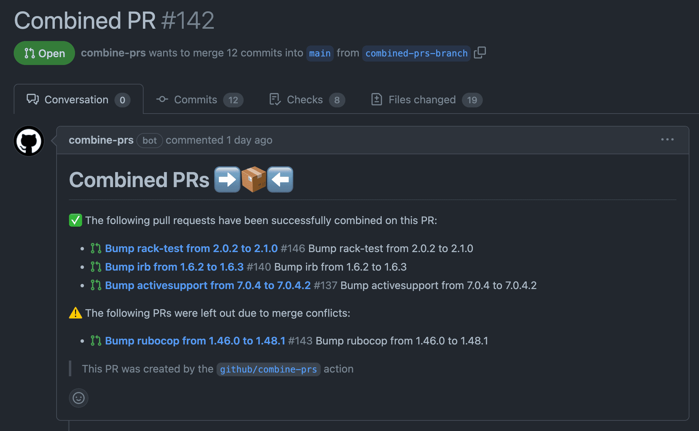
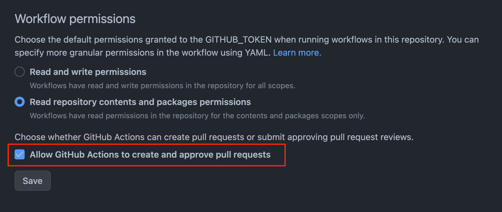

# combine-prs ➡️📦⬅️

[](https://github.com/github/combine-prs/actions/workflows/test.yml) [](https://github.com/github/combine-prs/actions/workflows/lint.yml) [](https://github.com/github/combine-prs/actions/workflows/codeql-analysis.yml) [](https://github.com/github/combine-prs/actions/workflows/package-check.yml) [](./badges/coverage.svg)

GitHub Action to combine multiple PRs into a single one

## About 💡

GitHub uses this Action to combine multiple dependabot PRs into a single one. Rather than having to deploy each PR individually, we can run this Action on a `cron` or `workflow_dispatch` to combine all the PRs into a single one to make dependency management just a little bit easier.

This Action is customizable so you can use it for your own purposes and it doesn't have to be specific to dependabot PRs.

## Notice 📢

> [!NOTE]
> A notice around the [Dependabot Grouped Version Updates feature](https://github.blog/changelog/2023-06-30-grouped-version-updates-for-dependabot-public-beta/)

As mentioned above is this README, a core reason why this Action exists is to "combine multiple Dependabot PRs into one". Work for this Action was completed before the [GitHub Blog Post](https://github.blog/changelog/2023-06-30-grouped-version-updates-for-dependabot-public-beta/) was published and the Dependabot Grouped Version Updates feature was released. While it may seem like this Action is no longer needed due to this feature, there are actually still quite a few use cases for this Action. The first one that is front of mind is that the PRs which Dependabot opens are grouped by package manager. This means that if you have a project that uses multiple package managers, you'll still end up with multiple PRs. This Action can be used to combine those PRs into a single one. You may also want to combine pull requests that are not related to Dependabot in anyway, which this Action can also do.

## Inputs 📝

| Name | Description | Default | Required |
| ---- | ----------- | ------- | -------- |
| `github_token` | GitHub token to use for authentication within this Action. Provided for you by default! | `${{ github.token }}` | `true` |
| `branch_prefix` | Prefix for the branch name to use for the combined PR | `dependabot` | `true` |
| `combine_branch_name` | The branch name to use for the combined PR | `combined-prs-branch` | `false` |
| `pr_title` | The title of the pull request to create | `Combined PRs` | `true` |
| `pr_body_header` | The header of the pull request body | `# Combined PRs ➡️📦⬅️` | `true` |
| `min_combine_number` | The minimum number of PRs that have to match criteria in order to create a combined PR | `"2"` | `true` |
| `branch_regex` | The regex to match the branches to combine - more control than branch_prefix | `""` | `false` |
| `ci_required` | Whether or not CI should be passing to combine the PR - can be `"true"` or `"false"`  | `"true"` | `true` |
| `review_required` | Whether or not reviews should be passing to combine the PR - can be `"true"` or `"false"` | `"false"` | `false` |
| `ignore_label` | The label to ignore when combining PRs | `"nocombine"` | `true` |
| `select_label` | The label which marks PRs that should be combined. Leave empty to consider all PRs. | `""` | `false` |
| `labels` | A comma separated list of labels to add to the combined PR - Example: `dependencies,combined-pr,etc` | `""` | `false` |
| `autoclose` | Whether or not to close combined PRs if the combined PR is merged - can be `"true"` or `"false"` | `"true"` | `false` |
| `update_branch` | Whether or not to update the combined branch with the latest changes from the base branch after creating the combined pull request | `"true"` | `false` |
| `create_from_scratch` | Whether or not to start from a clean base branch when (re)creating the combined PR | `"false"` | `false` |

## Outputs 📤

| Name | Description |
| ---- | ----------- |
| `pr_url` | The pull request URL if a PR was created |
| `pr_number` | The pull request number if a PR was created |

## Example 📸

Here is a PR example of this Action:



The Action ran on a cron, looked for all branches that had the `dependabot` prefix and then combined them into a single PR. Three pull requests were successfully combined and one was left out due to merge conflicts.

This allows us to deploy all the dependency updates at once rather than having to deploy each one individually.

## Usage 💻

Here is a brief example of how to use this Action in a workflow:

```yaml
name: Combine PRs

on:
  schedule:
    - cron: '0 1 * * 3' # Wednesday at 01:00
  workflow_dispatch: # allows you to manually trigger the workflow

# The minimum permissions required to run this Action
permissions:
  contents: write
  pull-requests: write
  checks: read

jobs:
  combine-prs:
    runs-on: ubuntu-latest

    steps:
      - name: combine-prs
        id: combine-prs
        uses: github/combine-prs@vX.X.X # where X.X.X is the latest version
        with:
          labels: combined-pr # Optional: add a label to the combined PR
```

## Permissions

This Action requires the following permissions:

```yaml
# The minimum permissions required to run this Action
permissions:
  contents: write # to create a new branch and merge other branches together
  pull-requests: write # to create a new PR with the combined changes
  checks: read # to check if CI is passing or not before combining PRs
```

This Action also requires that GitHub Action's has permissions to create new pull requests. You can read more about this feature here: [GitHub Blog Post](https://github.blog/changelog/2022-05-03-github-actions-prevent-github-actions-from-creating-and-approving-pull-requests/)

To enable this setting, go to `Actions` > `General` > `Workflow permissions` in your repository settings. Check the following box and click save:



## Regex Branch Patterns

By default, this Action uses the `branch_prefix` option set to `dependabot` to match the branches to combine. However, you can also use the `branch_regex` option to match branches using a regex pattern. This is useful if you want to match branches that don't have a specific prefix.

`branch_regex` is a string representing a regex pattern

If `branch_regex` is set, `branch_prefix` will be ignored.

## CI and Action's Token 🤖

If you need CI to re-run on your newly created "combined" PR, you'll need to use a token that has write access to your repository. This is because the default `github.token` that is provided to Actions prevents CI from running on new commits to prevent recursive workflows. You can use a personal access token or a GitHub App token to get around this.

```yaml
- name: combine-prs
  id: combine-prs
  uses: github/combine-prs@vX.X.X # where X.X.X is the latest version
  with:
    github_token: ${{ secrets.PAT }} # where PAT is a GitHub Action's secret containing a personal access token
```

### GitHub App Setup

Alternatively, you can use a GitHub App token. This is the **recommended** approach as it is **more secure** than a personal access token and a lot more scalable for large organizations.

Checkout the dedicated [documentation here](docs/github-app-setup.md) for more information on how to set this up.
