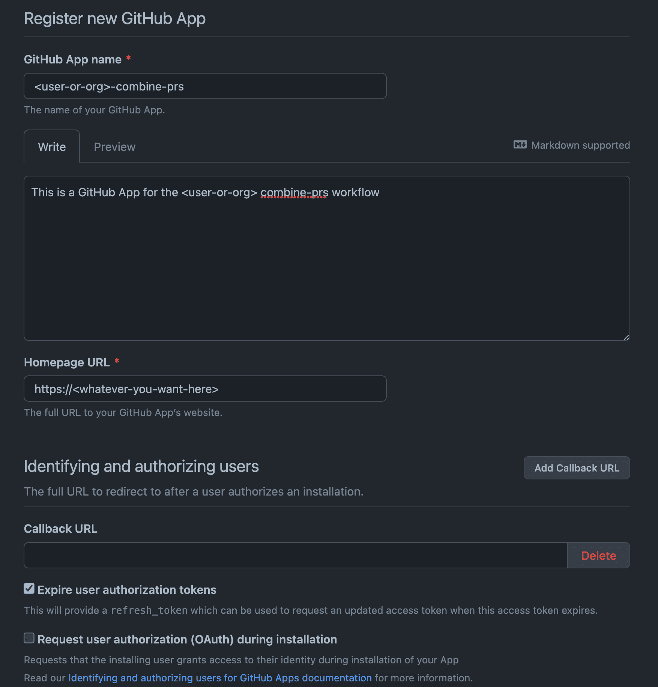
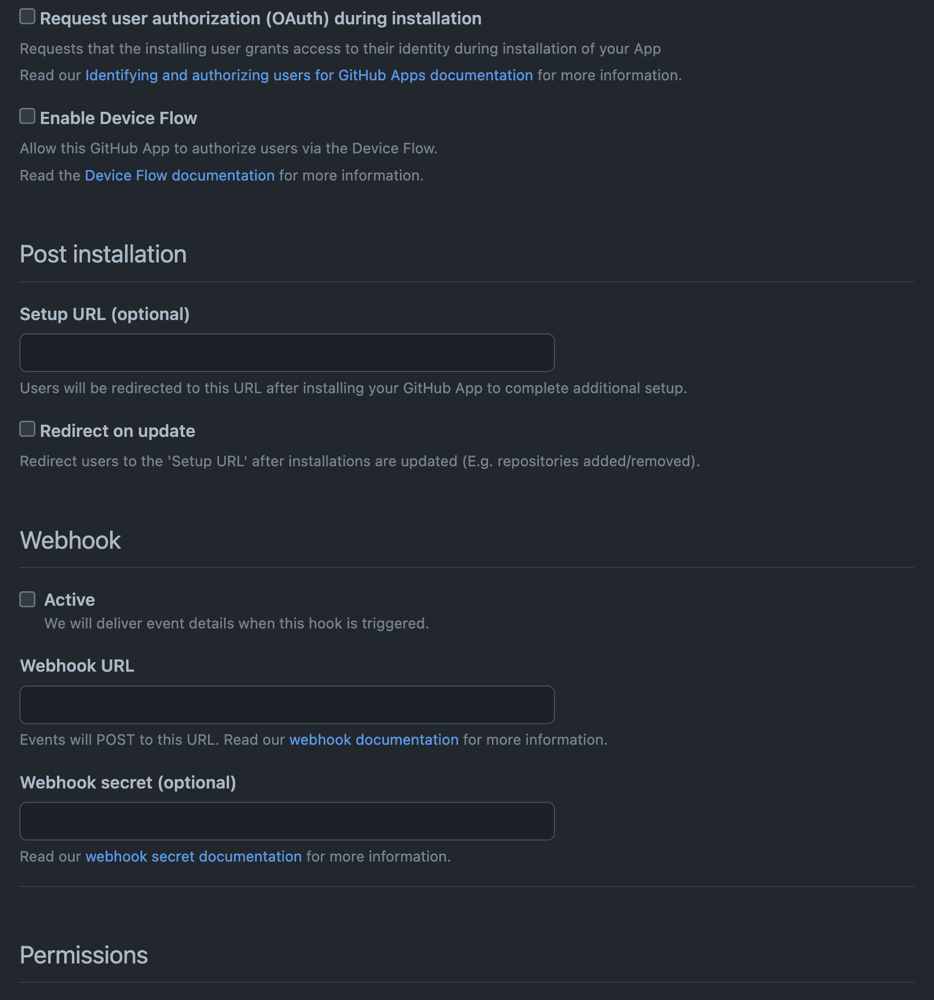
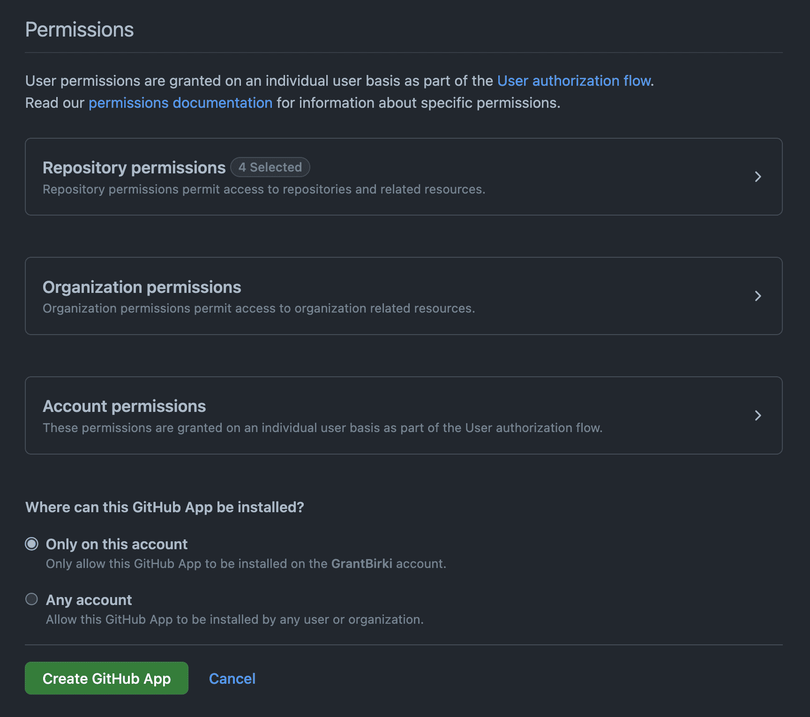
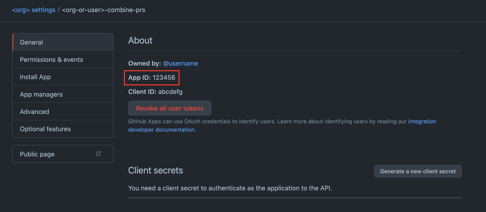
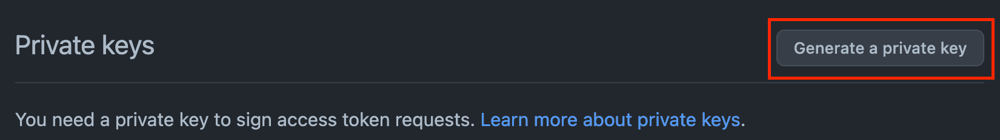

# GitHub App Setup

This section goes into detail on how to use a [GitHub App](https://docs.github.com/en/developers/apps/getting-started-with-apps/about-apps) to generate a token that can be used to run the `combine-prs` Action.

## Why use a GitHub App?

GitHub Apps are more scalable than personal access tokens. They can be installed on multiple repositories and can be used by multiple users. They also have a higher rate limit than personal access tokens. If you are an enterprise user, or organization with a lot of repositories, you *should* use a GitHub App instead of a personal access token.

## Setting up a GitHub App

Before we can write up the `combine-prs` Action, we need to create a GitHub App. You can do this by going to `Settings` > `Developer settings` > `GitHub Apps` > `New GitHub App`.

Follow along with the screenshots below to create a new GitHub App:



Enter a unique name for your GitHub App, a meaningful description, and any link you want. Ensure you expire user authorization tokens.



Keep all the defaults in the next section as indicated by the screenshot. The only thing you will want to do in this section is disable the `Webhook` option. Ensure `Active` is "unchecked".



In this section, you will want to enable the following repository permissions:

- Commit statuses: `Read-only`
- Contents: `Read and write`
- Metadata: `Read-only`
- Pull requests: `Read and write`

Also ensure that you select `Only on this account` for the installation option

Now you can go ahead and create your GitHub App!

## Configuring Secrets

In order for your `combine-prs` Action workflow to properly run, you will need to configure two secrets for your workflow using credentials from the GitHub App you just created.

### `APP_ID`

You can find your applications ID on the `General` page of your GitHub App. It will be listed as `App ID`.



Make note of your `APP_ID` as we will use it shortly

### `PRIVATE_KEY`

You will now need to generate a private key for your GitHub App. This section will also be located on the `General` page of your GitHub App.



> Note: When you generate a private key, it will download a `.pem` file. You will need to copy the contents of this file and paste it into your secret.

Make note of your `PRIVATE_KEY` as we will use it shortly

### Setting Secrets

Now that you have the values of both your `APP_ID` and `PRIVATE_KEY`, you can go ahead and set them as secrets in your repository. Where you wish to run the `combine-prs` Action, go to `Settings` > `Secrets` > `New repository secret`. Create the following two secrets:

- `APP_ID`: The ID of your GitHub App
- `PRIVATE_KEY`: The private key of your GitHub App

> Note: You can also set these secrets at the organization level if you wish to run the `combine-prs` Action across multiple repositories.

## Setting up the `combine-prs` Action

Now that the GitHub App is set up and the secrets are configured, we can go ahead and set up the `combine-prs` Action. *Finally*!

The following open source [Action](https://github.com/marketplace/actions/use-app-token) helps to generate a GitHub App token for you which can then be passed into the `combine-prs` Action.

Here is the example workflow that you can use to run the `combine-prs` Action with a GitHub App:

```yaml
name: Combine PRs

on:
  schedule:
    - cron: '0 1 * * 3' # Wednesday at 01:00
  workflow_dispatch:

# The minimum permissions to run this workflow
permissions:
  contents: write
  pull-requests: write
  checks: read

jobs:
  combine-prs:
    runs-on: ubuntu-latest

    steps:
      - name: Use GitHub App Token
        uses: actions/create-github-app-token@eaddb9eb7e4226c68cf4b39f167c83e5bd132b3e # pin@v1.5.1
        id: app-token
        with:
          app-id: ${{ secrets.APP_ID }} # The ID of the GitHub App
          private-key: ${{ secrets.PRIVATE_KEY }} # The private key of the GitHub App

      - name: combine-prs
        uses: github/combine-prs@vX.X.X # where X.X.X is the latest version
        with:
          github_token: ${{ steps.app-token.outputs.token }} # A GitHub app token generated by the previous step
          labels: combined-pr
```
